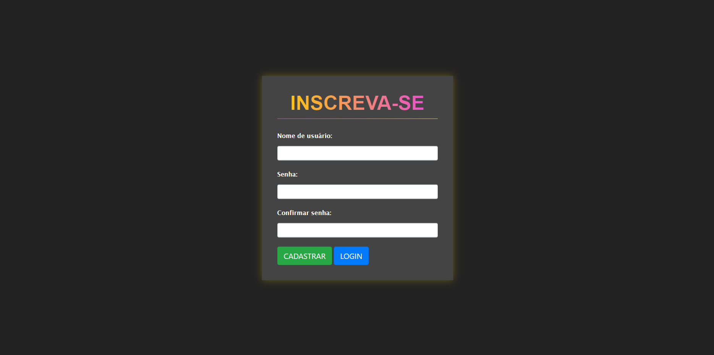
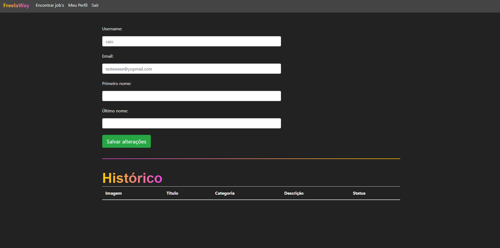
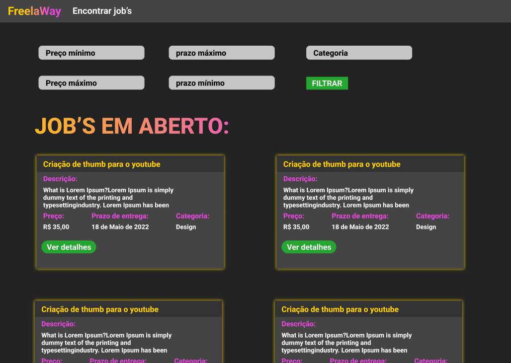
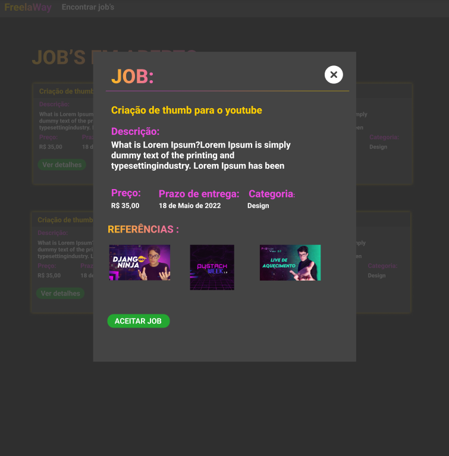

<h1 align="center">
   FreelaWay
</h1>

 

## :camera: Demonstração

## :rocket: Tecnologias

Esse projeto foi desenvolvido com as seguintes tecnologias:

✔️Python

✔️Django

✔️Bootstrap

✔️HTML5

✔️CSS3

## 💻 Projeto

Este projeto foi desenvolvido durante a [PYSTACK WEEK 3.0](https://pythonando.com.br/inscricao/psw3), evento realizado pela empresa [Pythonando](https://www.linkedin.com/company/pythonando/)

## ⚙ Configuração

Atenção! É necessário que você tenha o Python instalado!

1- Para iniciar o projeto:
> - Acesse o diretório principal do projeto
> Execute o comando correspondente ao seu Sistema Operacional (Windows ou Linux)
> - Windows: venv/Scripts/Activate
> - Linux: source venv/bin/activate

2- Para iniciar a aplicação:
> python manage.py runserver

3- Acesse a aplicação pelo link (A porta pode variar caso ela já esteja sendo ocupada no momento de execução):
> - [Home](http://127.0.0.1:8000/jobs/encontrar_jobs/)
> - [Perfil](http://127.0.0.1:8000/jobs/perfil/)
> - [Cadastro](http://127.0.0.1:8000/auth/cadastro)
> - [Login](http://127.0.0.1:8000/auth/logar)
